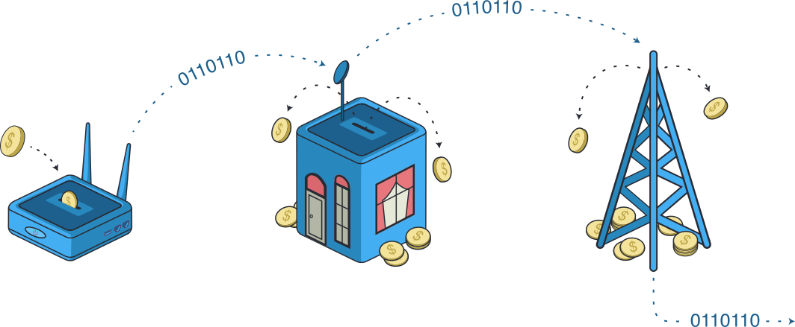

# Althea Blockchain

The Internet is a fundamentally cooperative network, representing the revolutionary idea of using technical systems to coordinate human groups.

But nearly 40 years later the limitations of the Internet’s first generation protocols are on display. The Internet is wonderfully decentralized, if you’re the sort of large technical organization that designed and participated in ARPANET.

For its 5 billion users the Internet has come to represent open information, inclusion, and the belief that everyone should have the access and opportunity to contribute. Blockchain is the natural evolution and the next step for that dream.

Althea introduced our [pay-per-forward protocol](https://www.youtube.com/watch?v=G4EKbgShyLw) in 2018, a trustless way of coordinating payments for bandwidth and network routing that is radical in its simplicity and efficiency.

People often ask, about both blockchain and Althea, why 'we don't want to trust anyone'. The point of trustless systems is exactly the opposite, when technology itself protects users from fraud and harm it becomes possible to trust _everyone_.

With pay-per-forward, running on the Althea blockchain, anyone can be an ISP and exchange bandwidth as a commodity. Any seller can contribute their resources and any buyer can purchase bandwidth.

The Althea blockchain is the community that will deliver this vision for the future of the Internet. A future where the internet itself operates on the principles it has inspired.

---

## Testnet 2

The next major event in the launch of the Althea blockchain is Testnet #2, which is online now! You can find the testnet 2 documentation [here](docs/althea/testnet-2.md)

---

## Join the Althea community!

Join us on [Discord](https://discord.com/invite/vw8twzR) or [Matrix](https://riot.im/app/#/room/#althea:matrix.org)

---

# Developer instructions

## Build and test

```
make
make test
```

## Updating the Gravity dependency

Note that you must use a git tag for releases to downstream chains, as this will produce the required binaries for the Gravity test suite

because go get does not have vendoring you will have to use the git hash not the tag

```
go get github.com/althea-net/cosmos-gravity-bridge/module@<git commit hash of tag>
go mod tidy
```

then open `tests/dockerfile/Dockerfile` and update the git tag of the dependencies

## Running the all up test suite

This suite runs the full gravity set of tests against this chain

```
bash tests/build-container.sh
bash tests/all-up-test.sh
```
