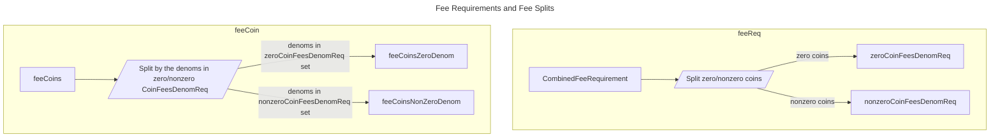
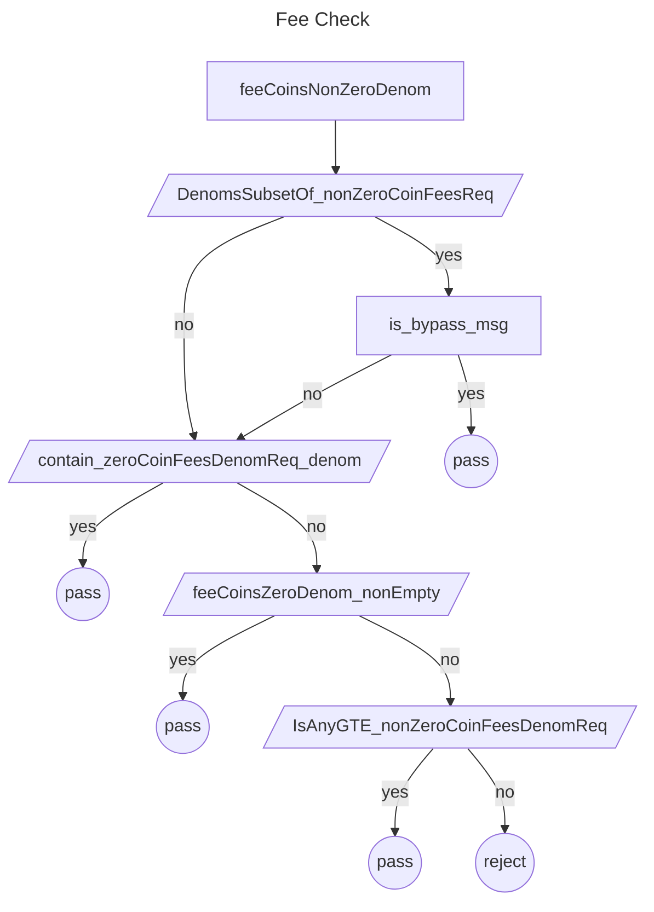

# ADR 002: Globalfee Module [DEPRECATED]

## Changelog

- 2023-06-12: Initial Draft
- 2024-06-06: Change status to deprecated

## Status

Deprecated

## Context

The globalfee module was created to manage a parameter called `MinimumGasPricesParam`, which sets a network-wide minimum fee requirement. The intention was to stop random denominations from entering fee collections and to reduce the time validators take to check a long list of transaction fees. To address scenarios where no fee payment is required but the denominations for volunteered paid fees are still restricted, the zero coins was introduced to serve as a means of limiting the denoms. Nevertheless, the initial version of the globalfee module had some issues:

- In the globalfee module, several Cosmos SDK coins methods were redefined because of the allowance of zero-value coins in the `MinimumGasPricesParam`. The `MinimumGasPricesParam` is of `sdk.DecCoins` type. In the Cosmos SDK, `sdk.DecCoins` are [sanitized](https://github.com/cosmos/cosmos-sdk/blob/67f04e629623d4691c4b2e48806f7793a3aa211e/types/dec_coin.go#L160-L177) to remove zero-value coins. As a result, several methods from `sdk.Coins` were [redefined in the Gaia fee antehandler](https://github.com/cosmos/gaia/blob/890ab3aa2e5788537b0d2ebc9bafdc968340e0e5/x/globalfee/ante/fee_utils.go#L46-L104).

- `BypassMinFeeMsgTypes` exists in `app.toml`, which means each node can define its own value. Thus, it's not clear whether a transaction containing bypass-messages will be exempted from paying a fee.

- The fee check logic is only executed in `CheckTx`. This could enable malicious validators to change the fee check code and propose transactions that do not meet the fee requirement.

## Decision

To fix these problems, the following changes are added to the globalfee module:

- **ZeroCoins in `MinimumGasPricesParam`:**\
  Refactor the fee check logics, in order to use the Cosmos SDK coins' methods instead of the redefined methods.
- **Bypass Message Types:**\
  `BypassMinFeeMsgTypes` is refactored to be a param of the globalfee module, in order to make the bypass messages deterministic.
- **Check Fees in `DeliverTx`:**\
  The fee check is factored to executed in both `DeliverTx` and `CheckTx`. This is to prevent malicious validators from changing the fee check logic and allowing any transactions to pass fee check. As a consequence, `MinimumGasPricesParam` is introduced as a globalfee param.

### ZeroCoins in `MinimumGasPricesParam`

#### Coins Split

`CombinedFeeRequirement` refers to the fee requirement that takes into account both `globalFees` (`MinimumGasPricesParam` in the globalfee module) and `localFees` (`minimum-gas-prices` in `app.toml`). This requirement is calculated as the maximum value between `globalFees` and `localFees` for denomination exists `globalFees`.
The allowance of zero coins in the `MinimumGasPricesParam` within the globalfee module implies that `CombinedFeeRequirement(globalFees, localFees)` also permits zero coins. Therefore, the `CombinedFeeRequirement` doesn't meet the requirements of certain `sdk.Coins` methods. For instance, the `DenomsSubsetOf` method requires coins that do not contain zero coins.

To address this issue, the `CombinedFeeRequirement` and `feeCoins` are split as shown in the chart below.



The `CombinedFeeRequirement` is split into zero and non-zero coins, forming `nonZeroCoinFeesReq` and `zeroCoinFeesDenomReq`. Similarly, the paid fees (feeCoins) are split into `feeCoinsNonZeroDenom` and `feeCoinsZeroDenom`, based on the denominations of `nonZeroCoinFeesReq` and `zeroCoinFeesDenomReq` as shown in the following code snippet.

```go
	nonZeroCoinFeesReq, zeroCoinFeesDenomReq := getNonZeroFees(feeRequired)

	// feeCoinsNonZeroDenom contains non-zero denominations from the feeRequired
	// feeCoinsNonZeroDenom is used to check if the fees meets the requirement imposed by nonZeroCoinFeesReq
	// when feeCoins does not contain zero coins' denoms in feeRequired
	feeCoinsNonZeroDenom, feeCoinsZeroDenom := splitCoinsByDenoms(feeCoins, zeroCoinFeesDenomReq)

```

#### Fee Checks

The Workflow of feeCheck is shown below:



The split enable checking `feeCoinsNonZeroDenom` against `nonZeroCoinFeesReq`, and `feeCoinsZeroDenom` against
`zeroCoinFeesDenomReq` (as shown in the following code snippet). In the check of `feeCoinsNonZeroDenom` against `nonZeroCoinFeesReq`, the Cosmos SDK coins' methods can be used since zero coins are removed from the `nonZeroCoinFeesReq`, while in the check `feeCoinsZeroDenom` against `zeroCoinFeesDenomReq`, only denoms need to be checked.

Checking `feeCoinsNonZeroDenom` against `nonZeroCoinFeesReq`:

```go
	if !feeCoinsNonZeroDenom.IsAnyGTE(nonZeroCoinFeesReq) {
		return ctx, sdkerrors.Wrapf(sdkerrors.ErrInsufficientFee, "insufficient fees; got: %s required: %s", feeCoins.String(), feeRequired.String())
	}
```

Here is an example of how the coins split and checked in fee antehandler:

**assumption**:

`globalfee=[1photon, 0uatom, 1stake]` and `local min-gas-prices=[0.5stake]`

**fee requirement**:

`combinedFeeRequirement=[1photon, 0uatom, 1stake]`

**split fee requirement**:

the `combinedFeeRequirement` into `nonZeroCoinFeesReq=[0uatom]`, and `nonZeroCoinFeesReq=[1photon, 1stake]`

**split the paid fees**:

if `paidFee=[1uatom, 0.5photon]`,
the `splitCoinsByDenoms` splits the paidFee into `feeCoinsZeroDenom=[1uatom]` (the same denom as zero coins in `combinedFeeRequirement`), and `feeCoinsNonZeroDenom=[0.5stake]`
then `feeCoinsZeroDenom=[1uatom]` is checked by `nonZeroCoinFeesReq=[1photon, 1stake]`.

Please note that `feeCoins` does not contain zero coins. The fee coins are split according to the denoms in `zeroCoinFeesDenomReq` or `nonZeroCoinFeesDenomReq`. If feeCoins contains coins not in both `zeroCoinFeesDenomReq` and `nonZeroCoinFeesDenomReq`, the transaction should be rejected. On the contrary, if feeCoins' denoms are in either `zeroCoinFeesDenomReq` or `nonZeroCoinFeesDenomReq`, and `len(zeroCoinFeesDenomReq)!=0`, the transaction can directly pass, otherwise, the fee amount need to be checked.

### Bypass Message Types

`BypassMinFeeMsgTypes` was a setup in `config/app.toml` before the refactor. `BypassMinFeeMsgTypes` is refactored to be a param of the globalfee module to get a network level agreement. Correspondingly,`MaxTotalBypassMinFeeMsgGasUsage` is also introduced as a globalfee param.

### Fee Checks in `DeliverTx`

Implementing fee checks within the `DeliverTx` function introduces a few requirements:

- **Deterministic Minimum Fee Requirement**: For the `DeliverTx` process, it is essential to have a deterministic minimum fee requirement. In `CheckTx`, fee is checked by the `CombinedFeeRequirement(globalFees, localFees)`, which considers both `minimum-gas-prices` from `config/app.toml` and `MinimumGasPricesParam` from the globalfee Params (For more details, see [globalfee](https://github.com/cosmos/gaia/blob/v16.0.0/docs/docs/modules/globalfee.md)). `CombinedFeeRequirement` contains non-deterministic part: `minimum-gas-prices` from `app.toml`. Therefore, `CombinedFeeRequirement` cannot be used in `DeliverTx`. In `DeliverTx`, only `MinimumGasPricesParam` in globalfee Params is used for fee verification. The code implementation is shown below.

```go
func (mfd FeeDecorator) GetTxFeeRequired(ctx sdk.Context, tx sdk.FeeTx) (sdk.Coins, error) {
	// Get required global fee min gas prices
	// Note that it should never be empty since its default value is set to coin={"StakingBondDenom", 0}
	globalFees, err := mfd.GetGlobalFee(ctx, tx)
	if err != nil {
		return sdk.Coins{}, err
	}

	// In DeliverTx, the global fee min gas prices are the only tx fee requirements.
	if !ctx.IsCheckTx() {
		return globalFees, nil
	}

	// In CheckTx mode, the local and global fee min gas prices are combined
	// to form the tx fee requirements

	// Get local minimum-gas-prices
	localFees := GetMinGasPrice(ctx, int64(tx.GetGas()))

	// Return combined fee requirements
	return CombinedFeeRequirement(globalFees, localFees)
}
```

- **Deterministic Bypass Parameters**: The decision of whether a message can bypass the minimum fee has to be deterministic as well. To ensure this, `BypassMinFeeMsgTypes` and `MaxTotalBypassMinFeeMsgGasUsage` parameters are moved to a persistent store.

- **Module Initialization Order**: The genutils module must be initialized before the globalfee module. This is due to the `DeliverGenTxs` in the genutils module, is called during `initGenesis`. This function executes `DeliverTx`, which subsequently calls the AnteHandle in FeeDecorator, triggering the fee check in `DeliverTx`.
  To prevent the `DeliverGenTxs` go through a fee check, the initialization of the globalfee module should occur after the genutils module. This sequencing ensures that all necessary components are in place when the fee check occurs. See [Gaia Issue #2489](https://github.com/cosmos/gaia/issues/2489) for more context.

## Consequences

### Positive

This refactor results in code that is easier to maintain. It prevents malicious validators from escaping fee checks and make the bypass messages work at network level.

### Negative

The introduction of FeeDecorator has replaced the usage of `MempoolFeeDecorator` in the Cosmos SDK. Currently, if both FeeDecorator and MempoolFeeDecorator are added to the AnteDecorator chain, it will result in redundant checks. However, there's potential for FeeDecorator and MempoolFeeDecorator to become incompatible in the future, depending on updates to the Cosmos SDK.
