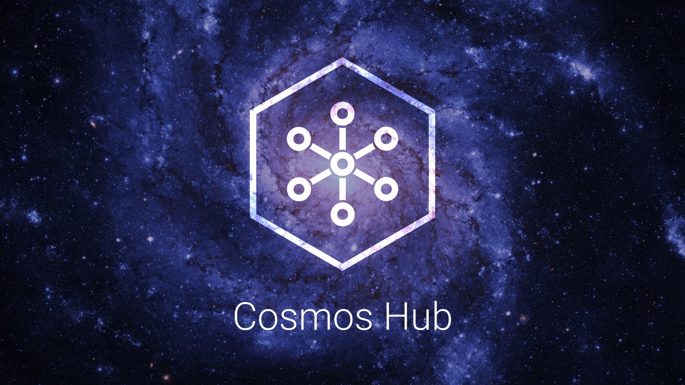

# Introduction

The Cosmos Hub is the first of many [interconnected blockchains](https://cosmos.network) powered by the interchain stack: [CometBFT](https://cometbft.com), [CosmosSDK](https://docs.cosmos.network) and [IBC](https://ibc.cosmos.network). The primary token of the Cosmos Hub is the **ATOM**.

## The ATOM

Do you have ATOM tokens? With ATOM, you have the superpower to contribute to the security and governance of the Cosmos Hub. Delegate your ATOM to one or more of the validators on the Cosmos Hub blockchain to earn more ATOM through Proof-of-Stake. You can also vote with your ATOM to influence the future of the Cosmos Hub through on-chain governance proposals.

Learn more about [being a delegator](./delegators/delegator-faq.md), learn about [the security risks](./delegators/delegator-security.md), and start participating with one of the following wallets.

## Cosmos Hub Wallets

:::tip
Do your own research and take precautions in regards to wallet security. Maintaining proper security practices is solely your responsibility when using third party wallets.
:::

These community-maintained web and mobile wallets allow you to store & transfer ATOM, delegate ATOM to validators, and vote on on-chain governance proposals. Note that we do not endorse any of the wallets, they are listed for your convenience.

- [Keplr](https://wallet.keplr.app) - Web
- [Ledger](https://www.ledger.com/cosmos-wallet) - Hardware
- [Cosmostation](https://www.cosmostation.io/) - Android, iOS
- [Leap Wallet](https://www.leapwallet.io/) - Android, iOS, Web
- [Atomic Wallet](https://atomicwallet.io/) - Android, Linux, macOS, Windows
- [Citadel.One](https://citadel.one/#mobile) - Android, iOS
- [Cobo](https://cobo.com/) - Android, iOS
- [Crypto.com](https://crypto.com/) - Android, iOS
- [Huobi Wallet](https://www.huobiwallet.com/) - Android, iOS
- [ShapeShift](https://app.shapeshift.com/) - Android, iOS, Web
- [imToken](https://token.im/) - Android, iOS
- [Math Wallet](https://www.mathwallet.org/en/) - Android, iOS, Web
- [Rainbow Wallet](https://www.rainbow.one) - Android, iOS
- [Trust Wallet](https://trustwallet.com/) Android, iOS
- [Komodo Wallet](https://atomicdex.io/en/)

## Metamask Snaps

- [Leap Wallet](https://www.leapwallet.io/snaps)
- [Mystic Lab](https://metamask.mysticlabs.xyz/)

## Cosmos Hub Explorers

These block explorers allow you to search, view and analyze Cosmos Hub data&mdash;like blocks, transactions, validators, etc.

- [Mintscan](https://mintscan.io)
- [Numia](https://www.datalenses.zone/chain/cosmos)
- [ATOMScan](https://atomscan.com)
- [IOBScan](https://cosmoshub.iobscan.io/)
- [Ping.Pub](https://ping.pub/cosmos)
- [BronBro](https://monitor.bronbro.io/d/cosmos-stats/cosmos)
- [SmartStake](https://cosmos.smartstake.io/stats)

## Cosmos Hub CLI

`gaiad` is a command-line interface that lets you interact with the Cosmos Hub. `gaiad` is the only tool that supports 100% of the Cosmos Hub features, including accounts, transfers, delegation, and governance. Learn more about `gaiad` with the [delegator's CLI guide](./delegators/delegator-guide-cli.md).

## Running a full-node on the Cosmos Hub Mainnet

In order to run a full-node for the Cosmos Hub mainnet, you must first [install `gaiad`](./getting-started/installation.md). Then, follow [the guide](./hub-tutorials/join-mainnet.md).
If you are looking to run a validator node, follow the [validator setup guide](./validators/validator-setup.md).

## Join the Community

Have questions, comments, or new ideas? Participate in the Cosmos community through one of the following channels.

- [Discord](https://discord.gg/interchain)
- [Cosmos Forum](https://forum.cosmos.network)
- [Cosmos on Reddit](https://reddit.com/r/cosmosnetwork)

To learn more about the Cosmos Hub and how it fits within the Cosmos Network, visit [cosmos.network](https://cosmos.network).
