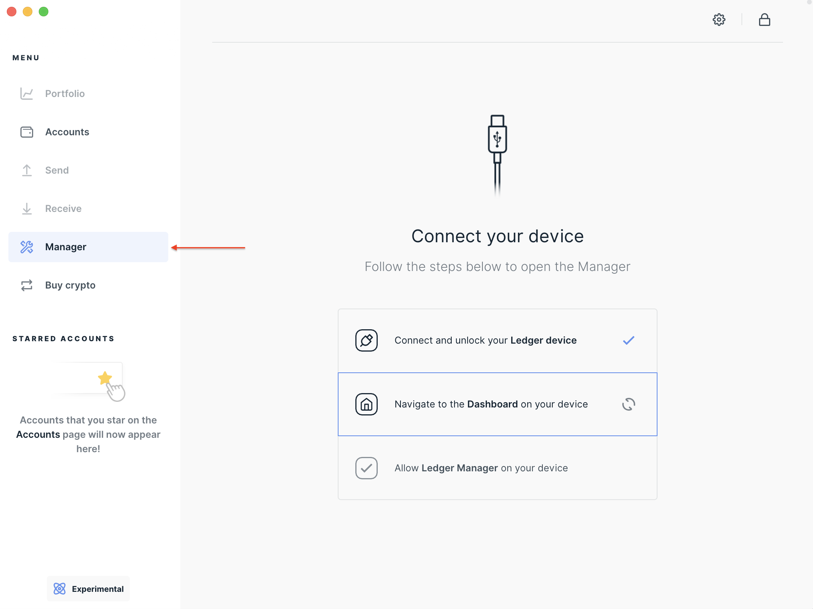

<!--
order: 4
-->

# Ledger Nano Support

Using a hardware wallet to store your keys greatly improves the security of your crypto assets. The Ledger device acts as an enclave of the seed and private keys, and the process of signing transaction takes place within it. No private information ever leaves the Ledger device. The following is a short tutorial on using the Cosmos Ledger app with the Gaia CLI or the [Keplr](https://www.keplr.app/) wallet extension.

At the core of a Ledger device there is a mnemonic seed phrase that is used to generate private keys. This phrase is generated when you initialize you Ledger. The mnemonic is compatible with Cosmos and can be used to seed new accounts.

::: danger
Do not lose or share your 24 words with anyone. To prevent theft or loss of funds, it is best to keep multiple copies of your mnemonic stored in safe, secure places. If someone is able to gain access to your mnemonic, they will fully control the accounts associated with them.
:::

## Install the Cosmos Ledger application

Installing the `Cosmos` application on your ledger device is required before you can use either [Keplr](#keplr-+-ledger-nano) or [`gaiad`](#gaia-cli-+-ledger-nano). To do so, you need to:

1. Install [Ledger Live](https://shop.ledger.com/pages/ledger-live) on your machine. 
2. Using Ledger Live, [update your Ledger Nano S with the latest firmware](https://support.ledger.com/hc/en-us/articles/360002731113-Update-device-firmware).
3. On the Ledger Live application, navigate to the `Manager` menu . 
    
4. Connect your Ledger Nano device and allow Ledger Manager from it. 
5. On the Ledger Live application, Search for `Cosmos`. 
    
6. Install the Cosmos application by clicking on `Install`.

::: tip
To see the `Cosmos` application when you search for it, you might need to activate the `Developer Mode`, located in the Experimental features tab of the Ledger Live application.
:::


## Keplr + Ledger Nano  

**Note: You need to [install the Cosmos app](#install-the-cosmos-ledger-application) on your Ledger Nano before following this section**

1. Connect your Ledger device to your computer, unlock it with the PIN and open the Cosmos app.
2. Install the [Keplr browser extension](https://www.keplr.app/).
3. Click on the Keplr extension icon and select `Import Ledger` and choose an account name and password.
5. Make sure your Ledger device is unlocked and has the Cosmos app open and then follow the instructions on the Keplr pop-up.

That's it! You can now use Keplr with your Ledger Nano S. You can use the [Keplr web app](https://wallet.keplr.app/#/dashboard) to get a more detailed overview of your Cosmos account.

**Note: Each time you will send a transaction, you will need to confirm it on your Ledger device. Indication will be prompted from the Keplr interface**

### (Optional) Confirm your address

You can double check that Keplr is displaying the correct address directly on your Ledger Nano device. To do so:

1. Connect your Ledger to your computer and open the Cosmos application on the device.
2. Once the Cosmos app is open, click on the right button to access the `Show Address` option.
3. Click on both button, then select `Account 0` and `Index 0`. 

You should now see the same address that is displayed on the Keplr extension. 

To learn more about using Keplr, we suggest you have a look at their [support documentation](https://keplr.crunch.help).
You can also have a look at the [Ledger support page](https://support.ledger.com/hc/en-us/articles/4411149814417-Set-up-and-use-Keplr-to-access-your-Ledger-Cosmos-ATOM-account?docs=true) for more details.

## Gaia CLI + Ledger Nano

**Note: You need to [install the Cosmos app](#install-the-cosmos-ledger-application) on your Ledger Nano before using following this section**

The tool used to generate addresses and transactions on the Cosmos Hub network is `gaiad`. Here is how to get started. If using a CLI tool is unfamiliar to you, scroll down and follow instructions for using the Keplr wallet instead.

### Before you Begin

- [Install Golang](https://golang.org/doc/install)
- [Install Gaia](https://cosmos.network/docs/cosmos-hub/installation.html)

Verify that gaiad is installed correctly with the following command

```bash
gaiad version --long

➜ cosmos-sdk: 0.34.3
git commit: 67ab0b1e1d1e5b898c8cbdede35ad5196dba01b2
vendor hash: 0341b356ad7168074391ca7507f40b050e667722
build tags: netgo ledger
go version go1.11.5 darwin/amd64
```

### Add your Ledger key

- Connect and unlock your Ledger device.
- Open the Cosmos app on your Ledger.
- Create an account in gaiad from your ledger key.

::: tip
Be sure to change the _keyName_ parameter to be a meaningful name. The `ledger` flag tells `gaiad` to use your Ledger to seed the account.
:::

```bash
gaiad keys add <keyName> --ledger

➜ NAME: TYPE: ADDRESS:     PUBKEY:
<keyName> ledger cosmos1... cosmospub1...
```

Cosmos uses [HD Wallets](./hd-wallets.md). This means you can setup many accounts using the same Ledger seed. To create another account from your Ledger device, run (change the integer i to some value >= 0 to choose the account for HD derivation):

```bash
gaiad keys add <secondKeyName> --ledger --account <i>
```

### Confirm your address

Run this command to display your address on the device. Use the `keyName` you gave your ledger key. The `-d` flag is supported in version `1.5.0` and higher.

```bash
gaiad keys show <keyName> -d
```

Confirm that the address displayed on the device matches that displayed when you added the key.

### Connect to a full node

Next, you need to configure gaiad with the URL of a Cosmos full node and the appropriate `chain_id`. In this example we connect to the public load balanced full node operated by Chorus One on the `cosmoshub-2` chain. But you can point your `gaiad` to any Cosmos full node. Be sure that the `chain-id` is set to the same chain as the full node.

```bash
gaiad config node https://cosmos.chorus.one:26657
gaiad config chain_id cosmoshub-2
```

Test your connection with a query such as:

``` bash
gaiad query staking validators
```

::: tip
To run your own full node locally [read more here.](https://cosmos.network/docs/cosmos-hub/join-mainnet.html#setting-up-a-new-node).
:::

### Sign a transaction

You are now ready to start signing and sending transactions. Send a transaction with gaiad using the `tx send` command.

``` bash
gaiad tx send --help # to see all available options.
```

::: tip
Be sure to unlock your device with the PIN and open the Cosmos app before trying to run these commands
:::

Use the `keyName` you set for your Ledger key and gaia will connect with the Cosmos Ledger app to then sign your transaction.

```bash
gaiad tx send <keyName> <destinationAddress> <amount><denomination>
```

When prompted with `confirm transaction before signing`, Answer `Y`.

Next you will be prompted to review and approve the transaction on your Ledger device. Be sure to inspect the transaction JSON displayed on the screen. You can scroll through each field and each message. Scroll down to read more about the data fields of a standard transaction object.

Now, you are all set to start [sending transactions on the network](../delegators/delegator-guide-cli.md#sending-transactions).

### Receive funds

To receive funds to the Cosmos account on your Ledger device, retrieve the address for your Ledger account (the ones with `TYPE ledger`) with this command:

```bash
gaiad keys list

➜ NAME: TYPE: ADDRESS:     PUBKEY:
<keyName> ledger cosmos1... cosmospub1...
```

### Further documentation

Not sure what `gaiad` can do? Simply run the command without arguments to output documentation for the commands in supports.

::: tip
The `gaiad` help commands are nested. So `$ gaiad` will output docs for the top level commands (status, config, query, and tx). You can access documentation for sub commands with further help commands.

For example, to print the `query` commands:

```bash
gaiad query --help
```

Or to print the `tx` (transaction) commands:

```bash
gaiad tx --help
```
:::

## The Cosmos Standard Transaction

Transactions in Cosmos embed the [Standard Transaction type](https://godoc.org/github.com/cosmos/cosmos-sdk/x/auth#StdTx) from the Cosmos SDK. The Ledger device displays a serialized JSON representation of this object for you to review before signing the transaction. Here are the fields and what they mean:

- `chain-id`: The chain to which you are broadcasting the tx, such as the `gaia-13003` testnet or `cosmoshub-2`: mainnet.
- `account_number`: The global id of the sending account assigned when the account receives funds for the first time.
- `sequence`: The nonce for this account, incremented with each transaction.
- `fee`: JSON object describing the transaction fee, its gas amount and coin denomination
- `memo`: optional text field used in various ways to tag transactions.
- `msgs_<index>/<field>`: The array of messages included in the transaction. Double click to drill down into nested fields of the JSON.

## Support

For further support, start by looking over the posts in our [forum](https://forum.cosmos.network/search?q=ledger)

Feel welcome to reach out in our [Telegram channel](https://t.me/cosmosproject) to ask for help.

Here are a few relevant and helpful tutorials from the wonderful Cosmos community:

- [Catdotfish](https://catdotfish.medium.com/) - [How to use the Keplr Wallet](https://medium.com/chainapsis/how-to-use-keplr-wallet-40afc80907f6)
- [Cryptium Labs](https://medium.com/cryptium-cosmos) - [How to store your ATOMS on your Ledger and delegate with the command line](https://medium.com/cryptium-cosmos/how-to-store-your-cosmos-atoms-on-your-ledger-and-delegate-with-the-command-line-929eb29705f)
